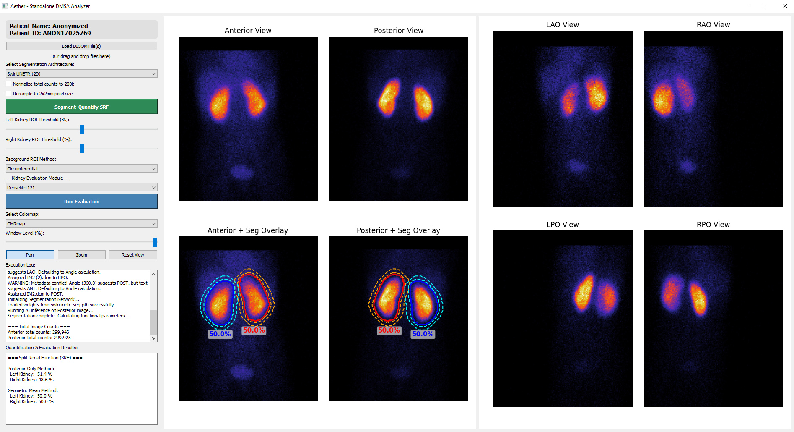

# DMSAAI


**DMSAAI** is a standalone AI-powered renal cortical scintigraphy analysis platform for Tc-99m DMSA studies. The application provides automated kidney segmentation, split renal function (SRF) quantification, and AI-assisted renal morphology evaluation from DICOM nuclear medicine images.

## Authors

Dr. Burak Demir - Mehmet Akif İnan Education and Research Hospital - Department of Nuclear Medicine - Şanlıurfa, Turkey

Dr. Demet Nak - Recep Tayyip Erdogan University - Department of Nuclear Medicine - Rize, Turkey

---


## Features

- Automated DICOM import with drag-and-drop support
- Support for anterior, posterior, and oblique DMSA views
- AI-based kidney segmentation using MONAI architectures:
  - SwinUNETR
  - SegResNet
  - DynUNet
- Automated Split Renal Function (SRF) calculation
  - Posterior-only method
  - Geometric mean method
- Background correction options:
  - Circumferential ROI
  - Center Rectangle ROI
  - Inferolateral Crescent ROI
- Image preprocessing
  - Pixel-size resampling
  - Count normalization
  - Automatic 256×256 standardization
- AI-assisted kidney evaluation
  - Cortical abnormality detection
  - Normal kidney classification
  - Afunctional/agenetic kidney detection
  - Horseshoe kidney detection
- Interactive visualization
  - Adjustable windowing
  - Multiple colormaps
  - Zoom and pan controls
  - Segmentation overlays

## Screenshot



## System Architecture

### Segmentation Module

The segmentation pipeline processes posterior DMSA images and generates pixel-wise masks for:

- Left kidney
- Right kidney
- Background regions

Supported segmentation networks:

| Model | Framework |
|---------|----------|
| SwinUNETR | MONAI |
| SegResNet | MONAI |
| DynUNet | MONAI |

### Quantification Module

Following segmentation, the software calculates:

- Gross renal counts
- Background-corrected counts
- Split Renal Function (SRF)

Methods:

1. Posterior-only counts
2. Geometric mean of anterior and posterior counts

### Classification Module

The evaluation module applies dedicated binary classification models to identify:

- Normal kidneys
- Cortical uptake abnormalities
- Afunctional kidneys
- Horseshoe kidney morphology

## Installation

### Requirements

- Python 3.10+
- PyTorch
- MONAI
- PyQt5
- OpenCV
- NumPy
- SciPy
- pydicom
- Matplotlib
- einops

## Model Weights

Place trained model weights in the application directory:

```text
swinunetr_seg.pth
segresnet_seg.pth
dynunet_seg.pth

cortical_anomaly_left.pth
cortical_anomaly_right.pth

normal_kidney_left.pth
normal_kidney_right.pth

afunctional_left.pth
afunctional_right.pth

horseshoe.pth
```

## Usage

Launch the application:

```bash
Double click directly to dmsaai.py
```

### Workflow

1. Load DMSA DICOM images.
2. Select a segmentation architecture.
3. Configure optional preprocessing.
4. Run **Segment & Quantify SRF**.
5. Review segmentation overlays and SRF values.
6. Run **Clinical Evaluation** for AI-assisted interpretation.

## Supported DICOM Views

The software automatically identifies:

- Anterior (ANT)
- Posterior (POST)
- Left Anterior Oblique (LAO)
- Right Posterior Oblique (RPO)
- Left Posterior Oblique (LPO)
- Right Anterior Oblique (RAO)

Detection is based on DICOM metadata and detector angles.

## Research Use

This software is intended for:

- Research
- Educational use
- Algorithm development

It is **not approved for standalone clinical decision making**.

## Citation

If you use DMSAAI in academic work, please cite the associated publication:

```text
Not published yet
```

## License

MIT license


